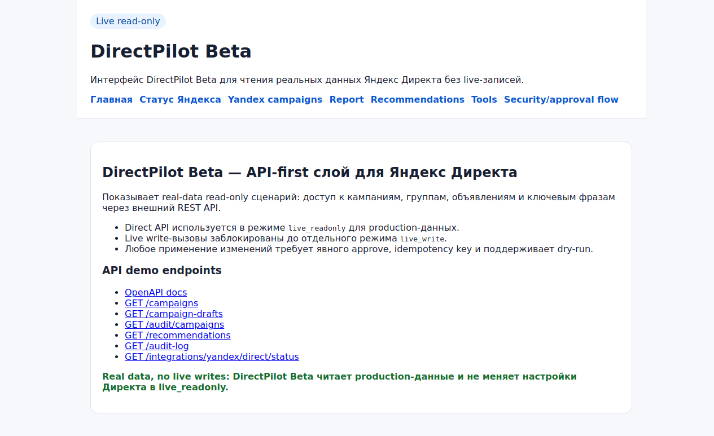
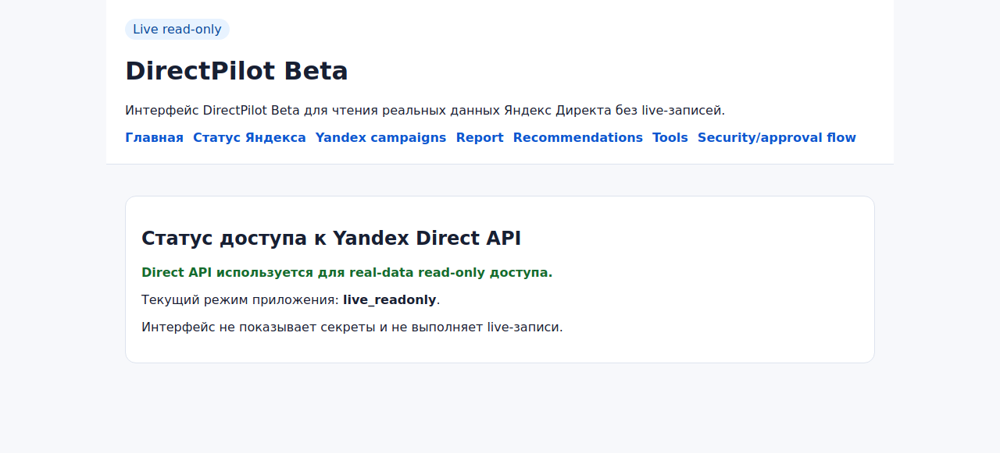
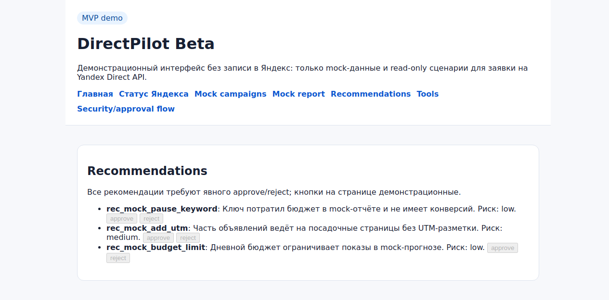
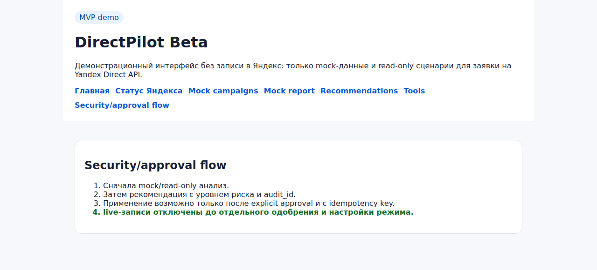

# DirectPilot Beta — техническая спецификация работы с API Яндекс Директа

## 1. Назначение приложения

**DirectPilot Beta** — backend-приложение для программного управления сценариями работы с Яндекс Директом через внешний REST API. Приложение предназначено для интеграции Директа с внешними системами: CRM, сайтом, аналитикой, внутренними сервисами и AI-агентами.

Ключевая идея — дать внешний API-слой поверх Директа: получать реальные рекламные данные, связывать их с внешними бизнес-сигналами, готовить сценарии изменений и выполнять ограниченные действия через API только в явно разрешённом режиме.

---

## 2. Возможности, которых нет в стандартном интерфейсе Директа

1. **API-first управление Директом внешними AI-агентами и сервисами.**  
   Кампаниями может управлять внешний сервис или AI-агент через единый REST API приложения.

2. **Сценарии автоматизации поверх Директа.**  
   Приложение позволяет строить цепочки: получение данных Директа → анализ внешних сигналов → подготовка изменения → проверка → применение действия.

3. **Интеграция с внешними источниками данных.**  
   Решения могут приниматься не только по данным Директа, но и по CRM, сайту, заявкам, звонкам, сквозной аналитике и внутренним бизнес-правилам.

4. **Программируемые бизнес-правила.**  
   Например: если кампания потратила заданный бюджет, но в CRM нет заявок или звонков, внешний агент может подготовить сценарий паузы кампании или изменения ставок.

5. **Единый технический слой для внешних интеграций.**  
   REST/JSON API приложения позволяет подключать ботов, внутренние панели, backend-сервисы и AI-агентов без прямой работы каждого сервиса с API Директа.

---

## 3. Технический стек

**Язык программирования:** Python  
**Требуемая версия Python:** `>= 3.11`  
**Текущая среда разработки:** `Python 3.13.11`

Основные библиотеки:

```text
FastAPI: 0.136.3
Uvicorn: 0.49.0
Pydantic: 2.13.4
pydantic-settings: 2.14.1
httpx: 0.28.1
pytest: 9.0.3
pytest-asyncio: 1.4.0
Starlette: 1.2.1
```

**Собственный API приложения:** REST/JSON.  
**Протокол взаимодействия с API Директа:** Yandex Direct API v5 JSON over HTTPS.  
**SOAP:** не используется.

Production endpoint API Директа:

```text
https://api.direct.yandex.com/json/v5
```

Sandbox endpoint сохранён только как отдельный режим разработки:

```text
https://api-sandbox.direct.yandex.com/json/v5
```

Авторизация:

```http
Authorization: Bearer [REDACTED]
Accept-Language: ru
Content-Type: application/json
```

OAuth token и другие секреты не выводятся в API-ответах, интерфейсе, документации и audit-log.

---

## 4. Текущий режим работы

Текущий рабочий режим приложения для реальных данных:

```text
DIRECTPILOT_MODE=live_readonly
```

В этом режиме приложение читает реальные данные production-аккаунта Директа, но не выполняет live-записи.

Поддерживаемые режимы:

```text
mock          — локальные демонстрационные данные без вызовов Директа
sandbox       — отдельная песочница API Директа для разработки
live_readonly — чтение production-данных без live-записей
live_write    — ограниченные production-записи после явного подтверждения
```

Реальные записи разрешаются только в `live_write`. Наличие реального OAuth token само по себе не включает запись.

---

## 5. Используемые методы API Директа

### `clients.get`

Проверка доступности OAuth token и доступа приложения к API Директа.

```json
{
  "method": "get",
  "params": {
    "FieldNames": ["Login", "ClientId"]
  }
}
```

### `campaigns.get`

Получение списка реальных кампаний и их статусов.

```json
{
  "method": "get",
  "params": {
    "SelectionCriteria": {},
    "FieldNames": ["Id", "Name", "Status", "State", "Type", "DailyBudget"]
  }
}
```

### `adgroups.get`

Получение групп объявлений по campaign id.

```json
{
  "method": "get",
  "params": {
    "SelectionCriteria": {"CampaignIds": ["[REDACTED_CAMPAIGN_ID]"]},
    "FieldNames": ["Id", "Name", "CampaignId", "Status", "ServingStatus", "Type", "RegionIds"]
  }
}
```

### `ads.get`

Получение объявлений по campaign id.

```json
{
  "method": "get",
  "params": {
    "SelectionCriteria": {"CampaignIds": ["[REDACTED_CAMPAIGN_ID]"]},
    "FieldNames": ["Id", "AdGroupId", "CampaignId", "Status", "State", "Type"],
    "TextAdFieldNames": ["Title", "Text", "Href"]
  }
}
```

### `keywords.get`

Получение ключевых фраз по campaign id.

```json
{
  "method": "get",
  "params": {
    "SelectionCriteria": {"CampaignIds": ["[REDACTED_CAMPAIGN_ID]"]},
    "FieldNames": ["Id", "AdGroupId", "CampaignId", "Keyword", "Bid", "Status"]
  }
}
```


### Расширенный read-only/API-first слой Яндекс Директа

DirectPilot Beta теперь содержит обёртки для полного практического read-only и аналитического покрытия Direct API v5. Все методы работают через реальный OAuth-токен из переменной окружения, но значение токена нигде не сохраняется и не выводится.

#### Аналитика reports

```text
GET /yandex/reports/live/CAMPAIGN_PERFORMANCE_REPORT?date_from=YYYY-MM-DD&date_to=YYYY-MM-DD
GET /yandex/reports/live/ADGROUP_PERFORMANCE_REPORT?date_from=YYYY-MM-DD&date_to=YYYY-MM-DD
GET /yandex/reports/live/AD_PERFORMANCE_REPORT?date_from=YYYY-MM-DD&date_to=YYYY-MM-DD
GET /yandex/reports/live/CRITERIA_PERFORMANCE_REPORT?date_from=YYYY-MM-DD&date_to=YYYY-MM-DD
GET /yandex/reports/search-queries-live?date_from=YYYY-MM-DD&date_to=YYYY-MM-DD
```

Назначение: статистика кампаний, групп, объявлений, условий показа и поисковых запросов. Ответ возвращается как read-only provider payload (`source=yandex`, `read_only=true`).

#### Настройки и диагностика кампаний

```text
GET /yandex/campaigns/{campaign_id}/bids              -> bids.get
GET /yandex/campaigns/{campaign_id}/bid-modifiers     -> bidmodifiers.get
GET /yandex/campaigns/{campaign_id}/negative-keywords?ids=1,2 -> negativekeywordsharedsets.get
GET /yandex/changes/check                             -> changes.check
GET /yandex/changes                                   -> changes.get
GET /yandex/dictionaries                              -> dictionaries.get
```

Назначение: ставки, корректировки ставок, минус-фразы, изменения в аккаунте и справочники Директа.

#### Аудит таргетингов и семантики

```text
GET /yandex/retargeting-lists                         -> retargetinglists.get
GET /yandex/campaigns/{campaign_id}/audience-targets  -> audiencetargets.get
GET /yandex/keywords-research/has-search-volume?keywords=...
GET /yandex/keywords-research/deduplicate?keywords=...
GET /yandex/keywords-research/wordstat/create?phrases=...&geo_ids=213
GET /yandex/keywords-research/wordstat/{report_id}
DELETE /yandex/keywords-research/wordstat/{report_id}
```

Назначение: аудит аудиторий, проверка спроса, дедупликация фраз и работа с Wordstat-отчётами.

#### Расширения объявлений и ассеты

```text
GET /yandex/sitelinks      -> sitelinks.get
GET /yandex/vcards         -> vcards.get
GET /yandex/ad-images      -> adimages.get
GET /yandex/creatives      -> creatives.get
GET /yandex/feeds          -> feeds.get
GET /yandex/businesses     -> businesses.get
GET /yandex/agency-clients -> agencyclients.get
```

Назначение: быстрые ссылки, визитки, изображения, креативы, фиды, организации и агентские клиенты. Эти endpoints нужны, чтобы программа могла строить полную карту аккаунта Директа, а не только кампании/ключи.

### `campaigns.suspend` и `campaigns.resume`

Ограниченные write-методы для постановки кампании на паузу и возобновления. В текущем режиме `live_readonly` реальные вызовы этих методов заблокированы. Реальный вызов возможен только в `live_write` при `approved=true`, `dry_run=false` и наличии `idempotency_key`.

---

## 6. Последовательность взаимодействия с API Директа

### 6.1. Проверка доступа

```text
Пользователь / внешний сервис
        |
        | GET /integrations/yandex/direct/status
        v
DirectPilot API
        |
        | clients.get
        v
Yandex Direct API production
        |
        | JSON response
        v
DirectPilot API
        |
        | нормализация ответа без вывода токена
        v
Пользователь / внешний сервис
```

### 6.2. Чтение реальных рекламных данных

```text
Пользователь / внешний сервис
        |
        | GET /yandex/campaigns
        v
DirectPilot API
        |
        | campaigns.get
        v
Yandex Direct API production
        |
        | список кампаний
        v
DirectPilot API
        |
        | source=yandex, read_only=true
        v
Пользователь / внешний сервис
```

Для выбранной кампании дополнительно вызываются:

```text
/yandex/campaigns/{id}/ad-groups -> adgroups.get
/yandex/campaigns/{id}/ads       -> ads.get
/yandex/campaigns/{id}/keywords  -> keywords.get
```

### 6.3. Проверка write-сценария без записи

```text
POST /yandex/campaigns/{campaign_id}/pause
approved=true
dry_run=true
idempotency_key=...
```

При `dry_run=true` сетевой write-запрос в API Директа не выполняется. Возвращается provider-shaped результат с `applied=false`.

### 6.4. Реальная запись

Реальная запись не является текущим рабочим режимом. Для неё нужен отдельный запуск:

```text
DIRECTPILOT_MODE=live_write
approved=true
dry_run=false
idempotency_key=<unique key>
```

Только после этого приложение может вызвать `campaigns.suspend` или `campaigns.resume`.

---

## 7. Частота вызовов и одновременные соединения

Текущий режим:

```text
Тип вызовов: on-demand, по действию пользователя или внешнего сервиса
Одновременные соединения к API Директа: 1 на операцию
HTTP-клиент: httpx.Client
Timeout: 20 секунд
Фоновые воркеры для Директа: не используются
Массовые live-write операции: не используются
```

Ориентировочная частота:

```text
clients.get: при проверке подключения
campaigns.get: по запросу или не чаще 1 раза в 15–60 минут на клиента
adgroups.get / ads.get / keywords.get и расширенные read-only методы: по запросу для выбранной кампании
reports: по запросу, с ограничением периода и учётом баллов API
keywordsresearch/Wordstat: только по явному запросу пользователя или внешнего сервиса
campaigns.suspend/resume: только по подтверждённому событию бизнес-правила или ручному запуску сценария
```

При росте нагрузки будут добавлены очередь задач, rate limiter, кэширование read-only данных и backoff при ошибках лимитов.

---

## 8. Текущий объём реальных данных

Проверенный production-аккаунт Директа:

```text
Логин: [REDACTED]
ClientId: [REDACTED]
Активные клиенты: 1
Кампании: 1
Группы объявлений: 1
Объявления: 1
Ключевые фразы: 32
```

Планируемый начальный production-объём:

```text
Активные клиенты: 1–10
Кампании: 10–100
Группы объявлений: 50–500
Объявления: 100–1000
Фразы: 500–5000
```

Потенциальный будущий объём:

```text
Активные клиенты: до 50
Кампании: до 1000
Объявления: до 10 000
Фразы: до 50 000
```

---

## 9. Учёт технических и бальных ограничений API Директа

1. **Минимизация вызовов.** Вызовы выполняются только по запросу пользователя/сервиса.
2. **Последовательное выполнение.** Массовые параллельные запросы на текущем этапе не используются.
3. **Разделение read/write.** `live_readonly` не может выполнять записи.
4. **Dry-run для write-сценариев.** Предварительная проверка не делает сетевой write-запрос.
5. **Idempotency key.** Повторный запрос с тем же ключом не должен повторно выполнять операцию в рамках текущего процесса.
6. **Units.** Клиент считывает заголовок `Units` из ответа API Директа для контроля расхода баллов.
7. **План масштабирования.** Очередь задач, rate limiter, backoff, кэш read-only данных, персистентное хранилище idempotency keys.

Последняя проверка read-only показала доступный остаток Units порядка:

```text
119689 / 120000
```

---

## 10. Обработка ошибок

### Отсутствует OAuth token

Сетевой вызов не выполняется. Возвращается нормализованная ошибка без раскрытия секретов.

### HTTP 4xx/5xx от API Директа

Raw body и headers не пробрасываются наружу. Приложение возвращает безопасную upstream-ошибку:

```http
502 Bad Gateway
```

Пример:

```json
{
  "detail": {
    "error_type": "YandexDirectError",
    "message": "Yandex Direct HTTP 401"
  }
}
```

### JSON error от API Директа

Если API Директа возвращает JSON с `error`, приложение сохраняет только редуцированную информацию:

```json
{
  "ok": false,
  "error": {
    "error_code": 8000
  }
}
```

### Сетевые ошибки

Ошибки транспорта преобразуются в безопасный вид:

```text
Yandex Direct transport error: <тип ошибки>
```

OAuth token не логируется и не возвращается во внешний API.

---

## 11. Проверенный live-readonly результат

Последний smoke-test локального API в режиме `live_readonly`:

```text
GET /health -> mode=live_readonly
GET /integrations/yandex/direct/status -> ok, Login=[REDACTED], ClientId=[REDACTED]
GET /yandex/campaigns -> source=yandex, count=1
GET /yandex/campaigns/[REDACTED_CAMPAIGN_ID]/ad-groups -> source=yandex, count=1
GET /yandex/campaigns/[REDACTED_CAMPAIGN_ID]/ads -> source=yandex, count=1
GET /yandex/campaigns/[REDACTED_CAMPAIGN_ID]/keywords -> source=yandex, count=32
```

Тесты проекта:

```text
113 passed, 1 warning
ruff check: All checks passed
```

---

## 12. OpenAPI-спецификация

Приложение предоставляет OpenAPI-спецификацию собственного REST API:

```text
http://127.0.0.1:8000/openapi.json
```

Интерактивная документация:

```text
http://127.0.0.1:8000/docs
```

---

## 13. Скриншоты интерфейса

### 13.1. Главная страница

Файл: `docs/screenshots/01-home.png`  
Описание: стартовая страница DirectPilot Beta. Показывает назначение приложения, навигацию и список API endpoints.



### 13.2. Статус подключения к Яндекс Директу

Файл: `docs/screenshots/02-yandex-status.png`  
Описание: экран статуса интеграции с API Директа. Показывает текущий режим подключения и подтверждает, что секреты не отображаются в интерфейсе.



### 13.3. Список кампаний

Файл: `docs/screenshots/03-campaigns.png`  
Описание: экран списка кампаний. Используется для read-only представления рекламных данных.


### 13.4. Рекомендации / сценарии действий

Файл: `docs/screenshots/04-recommendations.png`  
Описание: экран сценариев. Демонстрирует, как внешняя логика может подготовить действия для последующего запуска через API.



### 13.5. Security / approval flow

Файл: `docs/screenshots/05-security-approval.png`  
Описание: экран, описывающий последовательность выполнения сценариев: read-only анализ, подготовка действия, подтверждение и применение в разрешённом режиме.



---

## 14. Приложенные файлы

```text
docs/yandex-direct-application-spec.md
docs/openapi.json
docs/screenshots/01-home.png
docs/screenshots/02-yandex-status.png
docs/screenshots/03-campaigns.png
docs/screenshots/04-recommendations.png
docs/screenshots/05-security-approval.png
```
